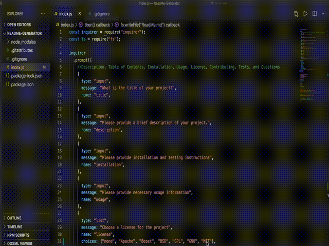

# Demo 

## Description

Generate a ReadMe quickly and easily by answering a couple of questions!

## Table of Contents

- [Description](#description)
- [Installation](#installation)
- [Usage](#usage)
- [License](#license)
- [Contributing](#contributing)
- [Tests](#tests)
- [Questions](#questions)

## Installation

Run NPM Install

## Usage

Run Node index.js

## License

none

## Contributing

Open Source

## Questions

If you'd like to check out my other repositories, please visit:

[Github Profile](https://github.com/vivianaarenas)

If you have any additional questions or want to reach out, please [email](mailto:vivianaaarenas@gmail.com) me!

## Demo

The following demonstrates the application up and running:

